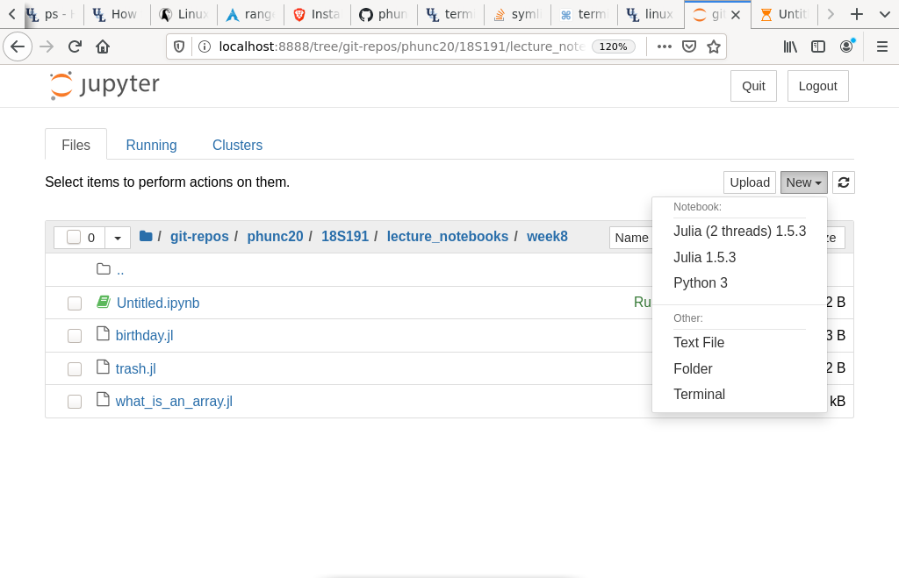

### Install a kernel in `IJulia / Jupyter Notebook`
Open Julia's REPL and do as follows.
```julia
julia> using IJulia
[ Info: Precompiling IJulia [7073ff75-c697-5162-941a-fcdaad2a7d2a]

julia> installkernel("Julia (2 threads)", env=Dict("JULIA_NUM_THREADS" => "2"))
[ Info: Installing Julia (2 threads) kernelspec in /home/phunc20/.local/share/jupyter/kernels/julia-(2-threads)-1.5
"/home/phunc20/.local/share/jupyter/kernels/julia-(2-threads)-1.5"

julia> notebook()
```
**Rmk.** One can indicate the root opened by `IJulia/Jupyter notebook` by specifying the arg `dir` as in `notebook(dir="~/home/downloads/")`

Once this is done, when Jupyter notebook is opened in the browser, one'd see sth similar to the following:



**Rmk.** Mr. Edelman chose to use `IJulia` for this lecture probably because he wanted to define the same function multiple times, each time modifying/improving it a little bit in order to better show the improvement each modification brings. In `Pluto` a function **can only** be defined exactly **one** cell, whereas in `IJulia/jupyter`, like with Python, functions can be defined and re-defined indefinitely.
